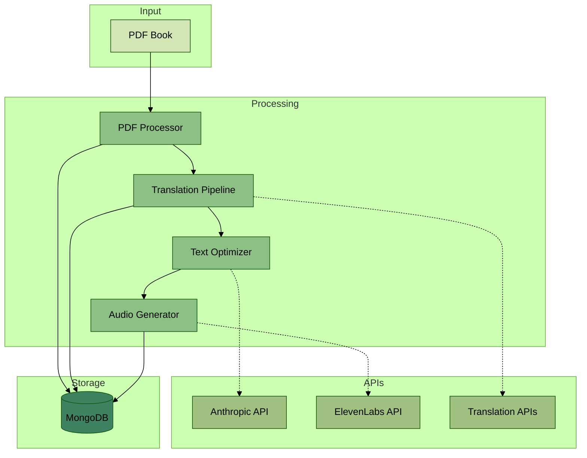
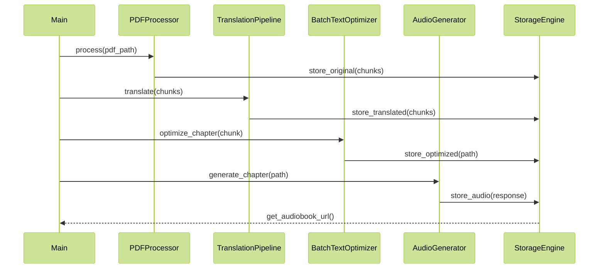
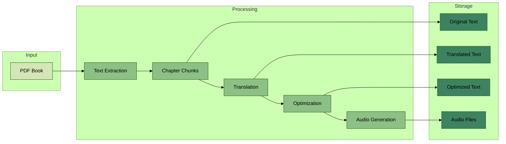

# Eleven Audiobooks Architecture

## System Architecture

## Component Interaction

## Data Flow

## Brief Description

The Eleven Audiobooks system is designed to convert large PDF books into high-quality audiobooks through a series of granular processing steps:

1. **PDF Processing**: 
   - Extracts text from PDF using PyPDF2
   - Splits into chapters using configurable markers
   - Tracks page numbers and references
   - Removes page markers, footnotes
   - Joins hyphenated words
   - Normalizes whitespace
   - Handles long text blocks by intelligent splitting
2. **Translation**: 
   - Processes each line individually through translation services
   - Maintains context between related lines
3. **Optimization**: 
   - Enhances each line for speech synthesis using Anthropic's API
   - Processes in small batches to stay within API limits
4. **Merging**: 
   - Recombines optimized lines while maintaining flow
   - Ensures proper paragraph and chapter transitions
5. **Audio Generation**: 
   - Creates audio files using ElevenLabs' text-to-speech service
   - Maintains consistent voice across merged content
6. **Storage and Data Model**: 
   - Uses Chapter dataclass to store metadata (number, title, content, page range)
   - Persists all intermediate results (chapters, lines, translations)
   - Uses MongoDB for metadata and file references
   - Stores large text chunks as separate files
   - Maintains traceability between original and processed content

The system uses asynchronous processing and batch operations where possible to improve efficiency. Each component is designed to be modular and independently testable.
